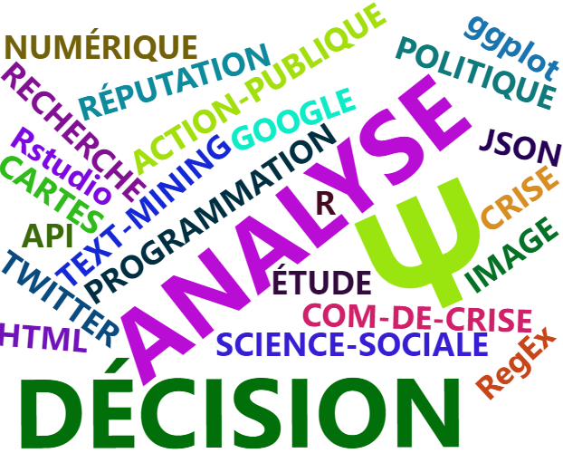
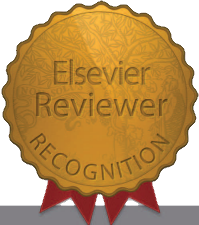

```{r recup-candidatures, eval=FALSE, include=FALSE}

# on va récuperer ton gmail avec mRpostman

library(mRpostman)

# IMAP settings
# attention, la il faut générer un mot de passe d'application sur ton compte Google (options => sécurité => authentification en deux étapes => tout en bas il y a "mot de passe d'app")
# ensuite, c'est ce mot de passe mystique qu'il faut entrer (les espaces comptent)

# Gmail
con <- configure_imap(
  url = "imaps://imap.gmail.com",
  username = "clementlvd@gmail.com",
  password = rstudioapi::askForPassword()
  )

# et maintenant, on liste les folders de la boite gmail pour vérifier la connexion imap 
con$list_mail_folders()

# pour sélectionner un folder de la connexion imap
# con$select_folder(name = "INBOX")

# MAIS NOUS ON EST LA POUR EN DECOUDRE AVEC LES PRATIQUES DES RECRUTEURS
con$select_folder(name = "CANDIDAT_CLEMENT")

# il y a aussi examine folder pour un autre folder que celui sélectionné, par exemple sent
# con$examine_folder(name = "Sent")

# et on peut extraire les mails par date par exemple !
# res <- con$search_before(date_char = "01-Sep-2023")
# on s'aperçoit que tu n'est pas descendu après septembre, et la liste vide est en fait répondue comme "NA" 

# s'il y a des mails, les fonctions comme search_before répondent une liste de "UD" de la boite mail IMAP, des "unique identifiers" de mes mails Gmail en l'occurence.

# mais on peut aussi faire des recherches, ne serait-ce que pour utiliser les FLAGS de la boite mail IMAP (des balises qui s'ajoutent si on répond, par exemple)

# You can also NEGATE the statement to search for messages NOT BEFORE a date, for example:
# 
# res <- con$search_before(date_char = "01-Sep-2023",
#                          negate = T, # c'est là que ça se passe le "search_before"...
#                          
#                          use_uid = TRUE,
#                          flag = c("ANSWERED", "SEEN"),
#                          
#                           esearch = TRUE ) #cette dernière commande "esearch" est spécifique à Google et quelques autres providers de mail 
# donc => attention ça peut déconner avec la plupart des hébergeurs IMAP qui ne gèrent pas le esearch (elastic search je suppose )

# res
# et on a bien nos mails de "CANDIDAT_CLEMENT"

# mais au lieu de "negate" comme des vikos, on peut aussi faire 
# res <- con$search_since(date_char = "01-Sep-2023",
#                         use_uid = TRUE)

# bref, on peut faire d'autres choses comme rechercher par période, etc. 
# voir les exemples => https://allanvc.github.io/mRpostman/articles/basics.html 
# on va se contenter de select les mails envoyés
res <- con$search_sent_since(date_char = "01-Sep-2023")
# et là, on voit que j'ai envoyé un paquet de mail de candidat clement (43)!

# il y a quelques options de recherche...

#### récupération des mails ####
require(tidyverse)

# on va maintenant récuperer les mails
#  tidy approach pour les headers !
out <- res %>%
  
  con$fetch_header(use_uid = TRUE, fields = c( "DATE", "SUBJECT") )

# sauf que c'est du vieil encodage merdique, pas UTF-8...
# out$headerUID1 %>% stringi::stri_enc_detect()

# fetch metadata 
test = res %>%  
  con$fetch_metadata(use_uid = TRUE, attribute = c("INTERNALDATE", "UID"
                                                   # , "ENVELOPE"
                                                   )) %>% data.frame() %>% t()

# str(test)
# donc on commence à bricoler notre dataframe avec cet objet monstrueux

test2 = data.frame(test) 

test2 = test2 %>%
  
  mutate(UID = str_extract(test, "[0-9]{1,2}"),
         
              DATE_ENVOI = str_extract(test, '"[0-9].*:[0-9]{2}(?= .0000")'))

# et voila un petit data frame ! 

# on peut aussi fetch le texte !!
s# increasing timeout_ms
con$reset_timeout_ms(x = 3000) # ... to 30 secs

# and supposing that you had verbose = TRUE before
con$reset_verbose(x = FALSE)

# tidy approach
test_body = res %>%
  con$fetch_body(write_to_disk = FALSE, keep_in_mem = T )
# il va écrire plein de fichiers textes si tu lui indique keep_in_meme = F ! beurk

# c'est le chaos, beurk
 test_body$body1 %>% data.frame()

test_cacaboudin = rbind.data.frame( test_body) 

test_cacaboudin <- test_cacaboudin %>% t() %>% data.frame()

colnames(test_cacaboudin) = "raw_content"
# test_cacaboudin2 <- iconv(test_cacaboudin, from = "ISO-8859-1", to = "UTF-8")

# on filtre les mails que toi tu as reçu, pour garder les mails envoyés
test_cacaboudin <- test_cacaboudin %>% filter(str_detect(raw_content, "Delivered-To. clementlvd@gmail.com|In-Reply-To", negate = T))
# tu en perd pas mal avec le "in-reply-to")

test_cacaboudin = test_cacaboudin %>% mutate(good = str_extract(raw_content, "(?<=Content-Transfer-Encoding. quoted-printable)[\\s\\S]*(?=06 33 22 31 65)" ) )

# et voila on a nos messages, a peu près propres

# on va aussi faire une variable avec le destinataire 
test_cacaboudin = test_cacaboudin %>% mutate(to = str_extract(raw_content, "(?<=To:).*" ),
                     objet = str_extract(raw_content, "(?<=Subject:).*")
                                             )

# test_cacaboudin$good[1]
# on a un dataframe avec nos 42 mails, mais c'est n'importe quoi l'encodage...
# test_cacaboudin$raw_content[1] %>% str()
  # stringi::stri_encode(test_text$text1, "UTF-8") %>% head()

# using fetch_text() , on peut récupérer les noms des pièces jointes !
# test_text = res %>%
#   con$fetch_text(write_to_disk = F) 
# %>%  list_attachments() # don't need to specify the connection object here
# si on veut on peut ajouter direct un "list_attachment"
```


```{css, echo=FALSE}
.pagedjs_page:not(:first-of-type) {
background: white;
}
.pagedjs_page:not(:first-of-type) {
--sidebar-width: 0rem;
--sidebar-background-color: #ffffff;
--main-width: calc(var(--content-width) - var(--sidebar-width));
--decorator-horizontal-margin: 0.1in;
}

```

<!--
 {width=9%} {width=9%}
 -->
 
<style>
p.comment {
background-color: #DBDBDB;
padding: 5px;
border: 0.1px solid black;
margin-left: 10px;
border-radius: 5px;
font-style: italic;
}

</style>

Aside
================================================================================

```{r IMAGE-NUAGES-DE-TERMES,eval=FALSE, include=FALSE}

# pour le fun on va faire une table des compétences et des expériences en R, rendons gloire à R


wrd = data.frame(words = c( "ANALYSE",
                            
                            "STATISTIQUES",  "DATAVIZ", "Ψ", "PSYCHOSOCIOLOGIE", 
                           
                       "DÉCISION",  
                       
                       "PROGRAMMATION", "TEXT-MINING", "CARTES",
                           
                           "R", "ÉTUDE", "RECHERCHE", "ACTION-PUBLIQUE", "COM-DE-CRISE", "IMAGE",  "RÉPUTATION",  "SCIENCE-SOCIALE",
                           "COMMUNICATION", "CRISE", "POLITIQUE", "INFLUENCES",    "DISCOURS-PUBLIC",
 "JOURNALISME", "NUMÉRIQUE", "FACEBOOK",  "TWITTER", "GOOGLE", "ORGANISATION", "CRISIS-MANAGEMENT", "JSON", "HTML", "Rstudio", "RegEx", "API", "spaCy", "quanteda", 
 
 "tidyverse", "ggplot", "ggmap", "leaflet", 
 
 "igraph",
 
 "REPRODUCTIBILITÉ" ),
                 
                 freq = c(3, rep(5,4),3, rep(1,36))) 

wordcloud2::wordcloud2(gridSize =  0.1, rotateRatio = 0.7,
  
  shape = "cardiod" , data = wrd , #,  color = "random-dark"
                       ellipticity = 0.2
                        )


# ET ON VA FAIRE UN NETWORK DE GROS DUR ET FINIR EN GGPLOT
# require(tidyverse)
# 
#  edge_list = data_frame(
#                 
#                 to =  c( "ANALYSE", 
#                          
#                          "STATISTIQUES", 
#                          
#                          "DATAVIZ",
#                          
#                        "TEXT-MINING", 
#                        
#                        "CARTES",
#                            
#                            "R",
#                        
#                        "IMAGE", 
#                        
#                         "JSON", "HTML", "Rstudio", "RegEx", "API", "spaCy", "quanteda", 
#  
#  "tidyverse", "ggplot", "ggmap", "leaflet", 
#  
#  "igraph",
#  
#  "REPRODUCTIBILITÉ" ) ) %>% mutate(from = "PROGRAMMATION") %>% select(from, to) 
#  
# 
#  vertex_list = c(unique(edge_list$from), unique(edge_list$to) ) 
# 
#  
# require(tidygraph)
# require(ggraph)
# 
#  
#  igraph::graph_from_data_frame(d = edge_list, directed = T, vertices = vertex_list) %>%
#    
#    igraph::plot.igraph() %>%
#  
# 
#    
#  ggraph::ggraph(layout = ) %>% ggraph::geom_edge_arc()  %>% ggraph::geom_node_label()

```




- <i class="fa fa-envelope left"></i>   clementlvd@gmail.com
- <i class="fa fa-phone left"></i>    06 33 22 31 65
- <i class="fa fa-home left"></i>    91570 - Bièvres (FR)
- <i class="fa fa-car left"></i>    Permis + Véhicule
- <i class="fab fa-researchgate left"></i>    [ResearchGate](https://www.researchgate.net/profile/Clement-Laverdet) 

<p class="comment"><font size="0.4"> C'est eux qui le disent : <br><i class="fa fa-user-graduate"></i> [Rapport de soutenance de thèse](https://drive.google.com/file/d/1f40opJVpny9-5iO4EdSWxqMOhKWShK46/view?usp=drive_link)</font></p>

<!--https://upload.wikimedia.org/wikipedia/commons/c/c3/Python-logo-notext.svg
https://upload.wikimedia.org/wikipedia/commons/thumb/c/c3/Python-logo-notext.svg/110px-Python-logo-notext.svg.png
https://upload.wikimedia.org/wikipedia/commons/thumb/1/1b/R_logo.svg/724px-R_logo.svg.png
-->

<span style="float:left;">               **COMPÉTENCES**</span>


<br>  <i class="fa fa-flask"></i> Recherches psychosociologiques
<br>  <i class="fa fa-database"></i> <i class="fa fa-linode"></i>Nettoyage / manip' de données 
<br><br>  <i class="fa fa-question-circle"></i><i class="fa fa-tasks"></i> Analyses d'enquêtes et de : 
<br>- *Textes* (supervisées ou non)<i class="fa fa-file-text-o right"></i>  <i class="fa fa-text-width right"></i>
<br>- Réseaux de relations<i class="fa fa-sitemap right"></i><i class="fa fa-project-diagram right"></i>
<br>- Cartes <i class="fa fa-globe right"></i><i class="fa fa-map right"></i>
<br>- Bases de données, capteurs, etc. <i class="fa fa-database right"></i>

{width=10%} {width=10%} Présentation des résultats  <i class="fa fa-braille right"></i>

<div> <br>
<i class="fa fa-code"></i>    ↓ **PROGRAMMATION**<br> {width=7%}    **R** <span style="float:right;"> **✪✪✪✪/✪✪✪✪** </span>
<br> {width=7%}    **RegEx** <span style="float:right;"> **✪✪✪/✪✪✪✪**  </span>
<br> {width=10%}  **CSS & html** <span style="float:right;"> **✪✪✪/✪✪✪✪** </span>
<br> {width=7%}    **Python** <span style="float:right;"> **✪✪/✪✪✪✪** </span>
<br> {<i class="fa fa-database"></i>} **SQL** <span style="float:right;"> **✪✪✪/✪✪✪✪**  </span>
<br><p class="comment"> <font size="0.45">Et d'autres méthodes : <br>- GO et Django (sites-web), <br>- Linux, DomoticZ (capteurs), <br>- Leaflet (cartes dynamiques), etc. </font></p>

<i class="fa fa-laptop"></i> Maîtrise de Rstudio, Limesurvey, suite Microsoft (e.g., Excel, PowerBI, PowerQuery, etc.) {width=25%}

<!--
- <i class="fa fa-braille"></i> **Analyses statistiques** (e.g., textes, cartes et réseaux)

- <i class="fa fa-gears"></i>  **Méthodes académiques** en psychosociologie (e.g., conception et analyse d'enquêtes) 


- <i class="fa fa-file-contract"></i> **Présentation des résultats** (e.g., rapports programmés, cartes dynamiques - leaflet)

-->
 
  
 

<p style="max-width: 30%; float: right;">{height=100% width=95%} </p><p class="comment"> **En + :**                       <i class="fa fa-location-arrow fa-rotate-90"></i> <font size="0.4"> <br>**A] Relecteur scientifique (revue TRF)** <br>B] Artisan confirmé  <i class="fa fa-screwdriver"></i> <br> C] Cofondateur d'un festival<br>D] Président d'association </font> 
</div>

<div style="text-align: justify"><p class="comment"> <i class="fa fa-cubes"></i><font size="0.4"> Expériences complémentaires
<br>- Chargé de coordination de projets (8 mois en 2015 - [carte de ces projets](https://rpubs.com/clementlvd/SUBMAP)) <i class="fa fa-sitemap right"></i> <br>
- Encadrement (p. ex. de stagiaires)<br>
- Organisation de conférences
</font></div> </p>   
<!--
{height=15% width=100%}

Disclaimer {#disclaimer}
--------------------------------------------------------------------------------

This resume was made with the R package [**pagedown**](https://github.com/rstudio/pagedown).

Last updated on `r Sys.Date()`.
-->


Main
================================================================================

Clément Laverdet - 34 ans {#title}
--------------------------------------------------------------------------------

###  

Psychosociologue, PhD. & data-scientist - [Site-web pro (consulting)](https://emage.netlify.app)

<div style="text-align: justify; line-height: 1.15"> <p class="comment">
**Ⅰ.       Conception de recherches de sciences sociales**
<br>**Ⅱ.      Analyses des données**
<br>**Ⅲ.    Restitution des résultats** 
<br><br><i class="fa fa-database"></i> <i class="fa fa-tasks"></i> <i class="fa fa-map-marked-alt"></i> *Mes analyses et documents restitués sont entièrement programmés - généralement en R (p. ex. mon manuscrit de thèse, rapports et documents Word)*    
 </p> </div>
 
 
Formations {data-icon=graduation-cap data-concise=true}
--------------------------------------------------------------------------------

### `r toupper("Bases de données relationnelles et SQL")`
<i class="fa fa-database"></i> Formation en ligne ([lien vers le certificat](https://courses.edx.org/certificates/07dd917be3654e058599574b3a1fa40e))

**Stanford University**

2022

### DOCTEUR EN PSYCHO-SOCIOLOGIE
N/A

**ED583 (UNÎMES / IMT Alès)**

2021

<div style="text-align: justify"> <i class="fa fa-user-graduate"></i> Thèse: Bilan des communications et des influences des acteurs français de la gestion des crises, notamment sur Facebook - [vidéo de la soutenance](https://youtu.be/Fao_hs98X5g) </div>
 
<!-- Titre de la thèse: RELATIONS PUBLIQUES ET EXPLOITATION DES RÉSEAUX SOCIAUX NUMÉRIQUES EN GESTION DES CRISES: QUELS RÔLES DE FACEBOOK POUR LES GESTIONNAIRES FRANÇAIS, ET COMMENT EXPLOITER CE CANAL DE FAÇON PERTINENTE ?-->

### `r toupper("Master Psychologie sociale et environnementale")`
<i class="fa fa-user-secret"></i>  & Titre de psychologue social

**Univ. Paris V**

2015<!--

Spécialité: Gestion des menaces sociales et environnementales-->

<hr>

Principales expériences {data-icon=suitcase}
--------------------------------------------------------------------------------

### `r toupper("Analyste de données")` <i class="fa fa-grav right"></i>
<i class="fa fa-gears"></i> XXX CGDD XXX

**XXX CGDD XXX**

2024
- XXX lol XXX
- Analyses de données (textes, enquêtes, géomarketing, réseaux) <span style= "float:right"> <i class="fa fa-comments"></i> <i class="fa fa-bar-chart"></i> <i class="fa fa-pie-chart"></i></span>
- Restitution des résultats et conseils <i class="fa fa-file-contract right"></i> 


### `r toupper("Analyste de données")` <i class="fa fa-grav right"></i>
<i class="fa fa-gears"></i> Micro-entreprise

**E-MAGE Consulting**

2023

- Analyses de données (textes, enquêtes, géomarketing, réseaux) <span style= "float:right"> <i class="fa fa-comments"></i> <i class="fa fa-bar-chart"></i> <i class="fa fa-pie-chart"></i></span>
- Restitution des résultats et conseils <i class="fa fa-file-contract right"></i> 

### `r toupper("Chargé de recherches")` (accidents routiers) <i class="fa fa-motorcycle right"></i> <i class="fa fa-bicycle right"></i><i class="fa fa-car right"></i>
<i class="fa fa-gears"></i> CDD 15 mois - Post-doctorat

**Univ. Gustave Eiffel** (Versailles)

2023 - 2021

- Analyses d'enquêtes (p. ex. analyses de textes supervisées)<i class="fa fa-users right"></i><br> 
- Analyse des accidents recensés par la police (2019 - 2021) <i class="fa fa-database right"></i> <br>
- **Restitutions : rapports ministériels INTEREDP et conférence (OCDE)** <i class="fa fa-book right"></i>
- Une publication scientifique et d'autres en cours de révision<i class="fa fa-file-contract right"></i> 

### `r toupper("Recherches de thèse")` (communications de crise) <i class="fa fa-bomb right"></i><i class="fa fa-fire right"></i><i class="fa fa-camera-retro right"></i>
<i class="fa fa-gears"></i> CDD 3 ans - Contrat doctoral et chargé d'enseignements

**UNÎMES**

2020 - 2016

- **Analyses des stratégies et de l'influence sur Facebook** (300 sources journalistiques, élus, villes, ministères, préfectures ou Présidence, etc.) <span style= "float:right"><i class="fa fa-facebook"></i><i class="fa fa-database"></i></span>
- Enquêtes et expérimentations autour des pratiques informationnelles habituelles des populations et de leurs réactions en situation d'urgence <i class="fa fa-users right"></i>
- **Bilans de crises et des rôles des communications** <span style= "float:right"><i class="fa fa-users"></i><i class="fa fa-comments-o"></i><i class="fa fa-database"></i></span>
- Présentations en conférences adressées aux élus, en ministères, etc. <i class="fa fa-file-contract right"></i>
- Conception de cours et chargé d'enseignements (psychologie sociale, statistiques et méthodes expérimentales de sciences sociales)

### `r toupper("Chargé de recherches")` (influences intergénérationnelles) <i class="fa fa-users right"></i> <i class="fa fa-chart-line right"></i> 
<i class="fa fa-gear"></i> Stage de recherche de 8 mois

**Mairie d'Igny**

2015

- Bilan de l'efficacité d'un programme de prévention (mesures longitudinales d'influences transgénérationnelles: enseignants → enfants → parents) <i class="fa fa-project-diagram right"></i> 
- Production de notes (e.g., conséquences d'une extinction de l'éclairage public) <i class="fa fa-file-contract right"></i>
<!--
::: concise

- Mise en place de mesures répétées, avant et après une semaine de 'projet environnemental' (questionnaires adressés aux parents des 3 écoles de la ville et aux enseignants)

:::


### `r toupper("Chargé de projets")` 
<i class="fa fa-cubes"></i> Gestion de projet associatif (6 mois)

Association **Le Submersible** (Igny)

2015 - 2014

- Formations et encadrement de groupes de travail → vers la mise en place de sensibilisations à l'écologie sur le site d'un festival - [carte leaflet de ces projets](https://rpubs.com/clementlvd/SUBMAP) <i class="fa fa-sitemap"></i>


### `r toupper("Stage de recherche (Master 1)")` 
<i class="fa fa-gear"></i> Stage de 3 mois 

**THIRD FLOOR SARL** (Chatenay-Malabry)

2014

- Mesure de l'engagement d'un public de musiciens professionnels              <i class="fa fa-music"></i> <i class="fas fa-drum"></i> <i class="fa fa-microphone"></i> 
- Conception d'une enquête → analyses → restitutions                                 <i class="fa fa-tasks"></i> <i class="fa fa-chart-line"></i> <i class="fa fa-file-contract"></i>
-->

### `r toupper("Chargé d’études statistiques")` (tests de recrutement)<i class="fa fa-people-carry right"></i> <i class="fa fa-align-left right"></i>
<i class="fa fa-gears"></i> CDD 4 mois 

**DRH de l’Armée de Terre** (Vincennes)

2014

- Mesure de la qualité des tests de recrutement de l’armée française <span style="float:right;"> <i class="fa fa-database"></i> <i class="fa fa-handshake"></i> <i class="fa fa-chart-line"></i></span>
- Autres recherches (e.g., rupture de contrat, performance des soldats) <i class="fa fa-tasks right"></i> 
- Restitutions des résultats (p. ex. présentations à la Cour des comptes) <i class="fa fa-file-contract right"></i>

Publications Scientifiques {data-icon=file}
--------------------------------------------------------------------------------
<!--Thèmes de recherche: crises, influence et pertinence des communications, communications numériques, accidents-->


*Trois articles réalisés en 2023 sont en cours de finalisation ou de révision*


### <i class="fa fa-file-contract"></i> Electric Personal Mobility Device Driver Behaviors, Their Antecedents and Consequences: A Narrative Review

*in* *Journal of Safety Research, Volume 87* (2023) https://doi.org/10.1016/j.jsr.2023.07.006

N/A

2023

**Laverdet, C.**, Malola, P., Meyer, T., Delhomme, P.

### <i class="fa fa-book"></i> 'Crisis' (Chapitre)

*in* 100 Key Concepts in Environmental Psychology, pp. 28-30, Routledge (Taylor & Francis)

N/A

2023

**Laverdet, C.**, Lapierre, D.

### <i class="fa fa-book"></i> 'Crises' (Chapitre)

*in* Psychologie environnementale : 100 notions clés, pp. 74-77, *Univers Psy* (Dunod). EAN: 9782100828289

N/A

2022

**Laverdet, C.**, Lapierre, D.


### <i class="fa fa-book"></i> Relations publiques et exploitation des réseaux sociaux numériques en gestion des crises : quels rôles de Facebook pour les gestionnaires français et comment exploiter ce canal de façon pertinente ? (Thèse)

https://tel.archives-ouvertes.fr/tel-03457426/file/74433_LAVERDET_2021_archivage.pdf

N/A

2021

**Laverdet, C.**, Directed by Weiss K., Tixier J., Bony-Dandrieux, A. & Caparos, S. 

### <i class="fa fa-book"></i> Entraînement numérique pour les autorités: qualifier la meilleure façon de communiquer (Chapitre)

*in* *Prise de décision en situation de crise: recherche et innovations pour une formation optimale* (Wiley)

N/A

2019

**Laverdet, C.**, Weiss, K., Bony‐Dandrieux, A., Tixier, J., & Caparos, S.


### <i class="fa fa-book"></i> What is the Best Way to Communicate During a Crisis ? (Chapitre)

*in* *Decision‐making in Crisis Situations: Research and Innovation for Optimal Training* (Wiley), pp. 149-173. https://doi.org/10.1002/9781119557869.ch7

N/A

2018 

**Laverdet, C.**, Weiss, K., Bony‐Dandrieux, A., Tixier, J., & Caparos, S. 


### <i class="fa fa-book"></i> Integrating Anthropocentric Approaches into Flood Risk Management (Chapitre)

*in* *Floods - Volume 2 - Risk Management* (ISTE), pp. 157-170. https://doi.org/10.1016/B978‑1‑78548‑269‑4.50011‑1

N/A

2017 

Gisclard, B., **Laverdet, C.**, Weiss, K. 


\newpage

**Quelques conférences** {data-icon=graduation-cap data-concise=true}
--------------------------------------------------------------------------------

### <i class="fa fa-chalkboard-teacher"></i> Typology of risky situations involving a Personal Mobility Device in Île-de-France

*in* 7th IRTAD Conference - Better road safety data for better safety outcomes. 27 - 28 Septembre 2022. www.itf-oecd.org/7th-irtad-conference-better-road-safety-data-better-safety-outcomes 

Lyon, FR

2022

**Laverdet, C.**, Meyer, T., Delhomme, P.


### <i class="fa fa-chalkboard-teacher"></i> Atelier et poster: Alerter les populations sur Facebook, un cap à franchir pour l’autorité ?

*in* Cap’Alert Mars 2019 - Diffuser autrement l’alerte à la population en cas de danger: une question de moyens ?

Avignon, FR

2019

**Laverdet, C.**, Weiss, K., Bony-Dandrieux, A., Tixier, J., & Caparos, S.

### <i class="fa fa-chalkboard-teacher"></i> Atelier: FACEBOOK COMME MÉTHODE DE RÉCOLTES DE DONNÉES SOCIOLOGIQUES OU DE RÉSEAUX. COMMENT S’Y REPÉRER ET TRAITER LES DONNÉES ? 
Atelier ‘méthodologie de la recherche et pluridisciplinarité’: Atelier Réseaux du LEST (CNRS) du 14 juin 2017. https://lest.fr/fr/activites-scientifiques/2017/06/14/lest/facebook-comme-methode-de-recoltes-de-donnees-sociologiques-ou-de-reseaux

Aix-en-Provence, FR

2017 

<!--
### <i class="fa fa-chalkboard-teacher"></i> Conférence: Se préparer à diffuser et à utiliser les données citoyennes lors d’une crise
JOURNEE IMdR « JEUNES INGENIEURS ET JEUNES CHERCHEURS ». ESTP, 16 mars 2017. www.imdr.eu/shop_818-47627-5299-835/journee-jeunes-ingenieurs-et-jeunes-chercheurs-2017.html 

Cachan, FR 

2017-->

**Laverdet, C.**, Weiss, K., Bony‐Dandrieux, A., Tixier, J., & Caparos, S. 

Et 20 autres conférences ou formations adressées aux professionnels, essentiellement entre 2017 et 2020